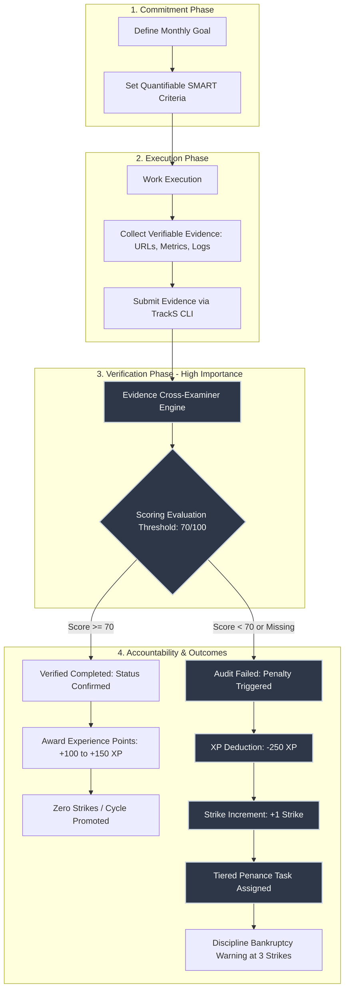

# TrackS: Autonomous Goal Accountability and Verification Engine

TrackS is an automated terminal-based system designed to prevent goal attrition. It enforces commitment compliance through evidence-based audits, quantitative scoring heuristics, calendar lifecycle tracking, and progressive penalties for unmet milestones.

---

## 1. System Architecture and Importance Hierarchy

The fundamental principle of TrackS is that unverified intentions degrade into failure. By enforcing a verification threshold prior to cycle close, TrackS bridges the gap between goal commitment and execution.



---

## 2. Core Use Cases

### Software Engineering and Open Source Development
- **Problem**: Developers start features or refactors that drag on indefinitely without deployment.
- **Application**: Commit to specific deployment endpoints, release tags, or test coverage thresholds (e.g., "Deploy v1.2 API to production with 95% integration pass rate by month-end").
- **Verification**: Evaluator verifies live URLs, commit hashes, and automated test reports.

### Technical Research and Academic Writing
- **Problem**: Long-form papers and literature reviews suffer from procrastination due to lack of immediate feedback.
- **Application**: Register word count, chapter draft, and citation count milestones.
- **Verification**: Document links, repository diffs, and page counts are verified by the scoring engine.

### Solo Founders and Product Deliverables
- **Problem**: Solo entrepreneurs fail to prioritize revenue-generating activities over minor aesthetic adjustments.
- **Application**: Define monthly deliverables tied to customer discovery calls, Stripe integration, or landing page conversion data.
- **Verification**: Metrics verification prevents rationalization of non-essential work.

### Physical and Habit Disciplines
- **Problem**: Daily workout and health habits degrade due to justification vocabulary ("busy", "almost", "next week").
- **Application**: Enforce monthly run distances or session logs with exported GPS or tracker data.
- **Verification**: Detection heuristics specifically penalize excuse terminology while validating data points.

---

## 3. Installation

TrackS provides self-extracting, isolated deployment scripts that configure global execution without requiring manual repository cloning or file placement.

### Windows Command Prompt (CMD)
```cmd
powershell -c "irm https://raw.githubusercontent.com/SoulaymaneBoulaich/TrackS/main/install.ps1 | iex"
```

### Windows PowerShell
```powershell
irm https://raw.githubusercontent.com/SoulaymaneBoulaich/TrackS/main/install.ps1 | iex
```

### macOS and Linux (Bash)
```bash
curl -fsSL https://raw.githubusercontent.com/SoulaymaneBoulaich/TrackS/main/install.sh | bash
```

### Installation Behavior
1. Prompts for a trusted destination directory (defaults to `~/.tracks`).
2. Unpacks the internal engine and configures required dependencies (`rich`, `pydantic`).
3. Registers the binary directory to the user's permanent `PATH` environment variable.
4. Launches TrackS immediately in the active terminal session.

---

## 4. Operational Modes

### Interactive Agent Shell
Once installed, launch the interactive workspace from any terminal:
```bash
tracks
```

The interface provides an active status panel, strike indicator, current cycle goals, pending penance tasks, and a command loop.

#### Available Menu Actions
- `1` / `dashboard`: Refresh and render the active monthly dashboard.
- `2` / `add`: Commit to a new monthly goal with verification criteria.
- `3` / `update`: Modify an existing goal title or evaluation criteria.
- `4` / `delete`: Remove a goal record from the database.
- `5` / `submit`: Record verifiable proof, metrics, or artifact URLs for a goal.
- `6` / `audit`: Run the automated cross-examination engine on submitted evidence.
- `7` / `clear-penalty`: Mark an assigned physical or digital penance task as completed.
- `8` / `history`: View historical audits, failures, and resolution records.
- `9` / `remove-history`: Purge individual or all historical penalty entries.
- `10` / `advice`: Request criteria optimization recommendations before committing.
- `11` / `rollover`: Run month-end reconciliation to process past-due unverified goals.
- `0` / `exit`: Terminate the active session.

### Direct Command-Line Interface (Non-Interactive)

TrackS commands can also be executed directly as subcommands:

#### Status and Listing
```bash
tracks status
```

#### Goal Management
```bash
# Add goal
tracks add "Ship v1.0 Production Release" --criteria "Pass 100% of integration test suite and deploy to production"

# Update goal
tracks update 1 --title "Ship v1.1 Production Release" --criteria "Updated deployment target with monitoring"

# Delete goal
tracks delete 1
```

#### Evidence and Audit
```bash
# Submit proof
tracks submit 1 "Deployed to https://api.service.internal. 14 unit tests passed on 2026-09-27."

# Execute audit
tracks audit 1
```

#### Penalty and Ledger Management
```bash
# Clear completed penance
tracks clear-penalty 1

# View historical ledger
tracks history

# Remove penalty record
tracks remove-history --penalty-id 1

# Force calendar rollover audit
tracks rollover
```

---

## 5. Evidence Evaluation & Scoring Specification

### Scoring Heuristics (0-100 Points)
The evaluation engine analyzes submitted evidence against objective criteria:

| Evaluation Vector | Scoring Weight | Criteria |
| :--- | :--- | :--- |
| Baseline | 50 points | Minimum allocation for non-empty submission |
| Documentation Volume | +15 / -20 points | Submissions >= 40 words award detail; < 10 words penalized |
| Quantifiable Metrics | +15 / -10 points | Detection of numeric values, percentages, or milestones |
| Artifact Validation | +15 points | Presence of verifiable URLs, repository paths, or file links |
| Temporal Markers | +5 points | Specific dates, completion timestamps, or milestones cited |
| Excuse Terminology | -15 points per match | Matches for justification terms ("tried", "almost", "busy", "sick", "next month") |

- **Passing Threshold**: 70 points or higher.
- **Pass Outcome**: Status updated to `VERIFIED_COMPLETED`, awards +100 to +150 XP.
- **Fail Outcome**: Status updated to `FAILED_PENALIZED`, deducts 250 XP, adds 1 strike, generates corrective roast feedback, and assigns a penance task.

### Escalation Hierarchy

| Strike Count | Severity Level | Consequence | Assigned Penance Scope |
| :--- | :--- | :--- | :--- |
| 0 Strikes | Light / Medium | -250 XP, Strike +1 | Immediate physical sets (pushups) or 3-minute cold shower |
| 1 Strike | Severe | -250 XP, Strike +2 | 36-hour digital detox or 5km outdoor run |
| 2 Strikes | Catastrophic | -250 XP, Strike +3 | 48-hour entertainment blackout, 200 pushups, written post-mortem |
| 3 Strikes | Discipline Bankruptcy | System Freeze | Mandatory completion of all backlog penalties before new goals are unlockable |

---

## 6. Automated Testing and Verification

The test suite validates database persistence, heuristic parsing, state transitions, calendar rollover, and interactive commands.

Run tests using pytest:
```bash
python -m pytest tests -v
```

All 14 tests run against an isolated SQLite test database and must pass with zero warnings or errors.

---

## 7. License

Distributed under the terms of the MIT License. See [LICENSE](LICENSE) for details.
